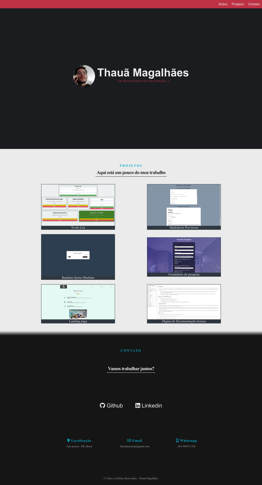

<h1 align="center">
  💻 Portfólio - Thauã Magalhães
</h1>

## 
 <u>Preview da página:</u> 

  

<h4 align="center"><a href="https://tahaluh.github.io/portfolio/">Clique para visitar o projeto</a></h4>

---
# 📚Seções

O site é composto por 3 seções:

- **Sobre**: Onde há uma apresentação breve;
- **Projetos**: Seção onde são apresentados alguns dos meus projetos;
- **Contato**: Local onde estão disponíveis minhas redes sociais e formas de contato.
---
# 💼 Tecnologias Utilizadas

As seguintes ferramentas foram usadas na construção do projeto:

- Html
- Css

*Também foram aplicados conceitos de html semântico, seo e responsividade*

---

Feito por Thauã Magalhães 👋🏽 Entre em contato!

 

